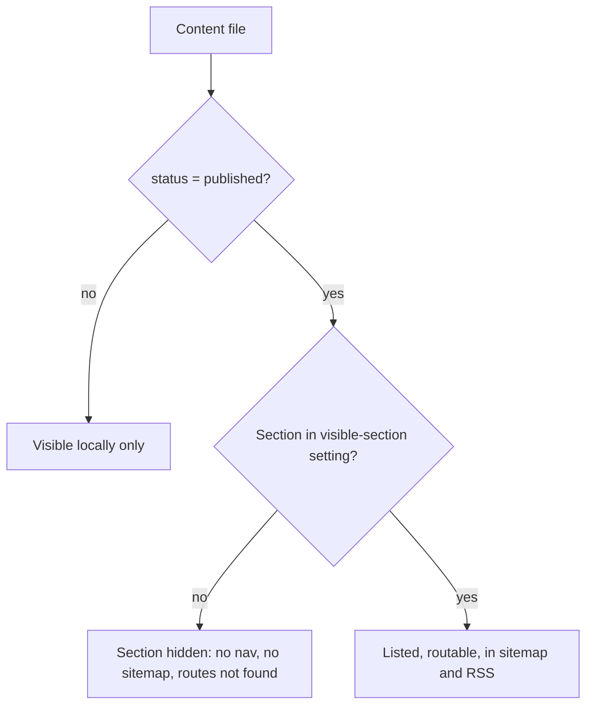
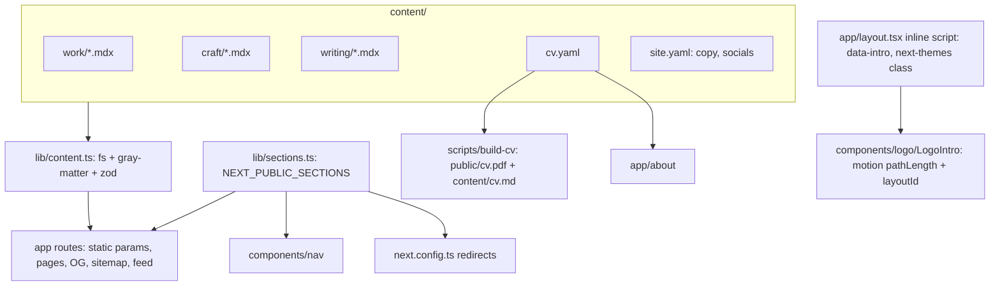

# Portfolio Rebuild - Plan

## Goal Capsule

- **Objective:** Replace andrevital.com with a Next.js 16 site whose content lives in the repo, positioned for hiring managers and freelance clients as "senior React engineer who ships finished, polished product UI with real motion, UX and design judgment". v1 is the shell (Home, About + CV, Writing, Contact); Work and Craft are built but flag-hidden until their content exists.
- **Product authority:** This plan owns the rebuild of the site and the decommission of the old backend. Project content production (case-study copy, screenshots, video for Work entries) is a separate later sprint and is not active scope.
- **Execution profile:** Deep plan, four phases, nine implementation units, each an atomic pull request on a `feat/rebuild` branch; Phase A lands before any page work; Phase D is the cutover.
- **Open blockers:** None. Deferred questions are listed under Planning Contract, Open Questions.

---

## Product Contract

### Summary

Rebuild andrevital.com as a Next.js 16 App Router site with MDX content in the repo and no backend, deployed on Vercel only. Editorial single-page structure, dark-first with a light toggle, the logo draw-and-dock as the signature motion moment, and per-entry plus per-section visibility controls so sections can ship before their content does.

### Problem Frame

The live site is a 2022 build (Next 13 pages router, twin.macro, Strapi on Heroku) last touched in August 2025. Its two portfolio sections render "still working on stuff" placeholders because the CMS holds zero projects; the blog has one post from 2024; the About page clips the first letters of every paragraph through a horizontal overflow caused by reversed `clamp()` widths; "Download CV" 404s because the link asks for `cv.pdf` while the tracked file is `CV.pdf`, which only a case-sensitive host exposes. A 4 second splash plays on every visit, about 590 KB of JavaScript ships for a static brochure, and the Strapi, Postgres, S3 and Heroku tier exists to serve 7 CV jobs and one article. The stack itself is stale: twin.macro has no Tailwind 4 or React 19 story, Yarn 1 is frozen, Heroku is in sustaining mode.

An active job search makes this the wrong moment for the site to undersell. The register also reads dated against 2026 peers (rauno.me, paco.me, emilkowal.ski, jakub.kr): icon rail, splash preloader, tiled background, hover-zoom cards. Meanwhile the content that could fill it exists but has no assets: several personal products (roomfit, tatem, merma, meal-tracker), agency work under NDA (TitanX design system, Known), and DX tooling.

### Key Decisions

- **Next.js 16 App Router, React 19 with the React Compiler, Tailwind 4, `motion` plus GSAP, pnpm, Biome, Node 22.** (session-settled: user-approved, chosen over Astro 6 and TanStack Start: the live React demos in Craft erase Astro's static advantage, and TanStack leaves MDX, RSS and OG generation hand-rolled for a site touched a few times a year.) Governs R33, R34.
- **Content in the repo as MDX and typed data; no backend, no CMS, no database.** (session-settled: user-approved, chosen over Strapi 5 or Payload 3: the CMS held 7 jobs and 1 post and is edited a few times a year.) Governs R25, R26, R37.
- **Photography section removed.** (session-settled: user-directed, chosen over keeping or hiding it: André no longer practices photography.) Governs R38.
- **One Work section with entries tagged client, personal or tool, over separate Projects and Tools sections.** (session-settled: user-approved: thin sections read worse than one filterable list.) Governs R12, R13.
- **Editorial, typographic structure with the logo choreography as the only set-piece.** (session-settled: user-approved, chosen over a motion-forward hero or a product reel: restraint carries the taste signal; the motion budget goes to the logo and to Craft.) Governs R5, R6, R7.
- **Logo choreography: draw-and-dock on the first visit of a session, inline draw on return, inline draw always under reduced motion.** (session-settled: user-approved, chosen over drawing on every visit or scroll-driven docking.) Governs R7, R8, R9.
- **Logo isotype structure is locked; only its animation and its color variant per theme may change.** (session-settled: user-directed.) Governs R7, R11.
- **Dark by default with a light toggle.** (session-settled: user-approved, chosen over dark-only: every Craft piece and screenshot must hold in both themes.) Governs R10, R11.
- **Build every section, hide with flags; v1 replaces the live site as the shell only.** (session-settled: user-directed, chosen over waiting for Work and Craft content: fixes the broken live site sooner.) Governs R1, R2, R27, R28, R29.
- **Craft becomes visible at three finished pieces.** (session-settled: user-approved, chosen over launching with the logo alone.) Governs R17.
- **The CV has one source in this repo; the About page and the PDF render from it and career-ops reads it.** (session-settled: user-approved, chosen over a hand-exported PDF or two separate copies.) Governs R21, R22, R23.
- **Writing stays as a first-class section.** (session-settled: user-directed.) Governs R18, R19, R20.
- **Project content production is parked.** (session-settled: user-directed.) See Scope Boundaries.

### Actors

- A1. Hiring manager or recruiter screening for senior front-end or design-engineering roles. Skims in about 90 seconds, then opens one Work entry, one Craft piece, or the source.
- A2. Freelance or consulting client evaluating whether to hire André for a build. Cares about finished products and reliability.
- A3. André as author and maintainer. Adds content by editing files and opening a pull request; touches the site a few times a year.

### Requirements

**Site structure and navigation**

- R1. The site has these sections: Home, Work, Craft, Writing, About (including the CV), Contact.
- R2. Each of Work and Craft can be hidden as a whole by a deploy-time setting; a hidden section has no navigation entry, no sitemap entry, and its routes return not-found.
- R3. Navigation is a single compact bar with the logo mark and text links; no icon rail and no icon font.
- R4. Route changes animate as a lightweight transition (View Transitions where the browser supports them, an instant swap elsewhere); no full-page slide.

**Home and positioning**

- R5. Home leads with André's name and a one-sentence positioning as a senior front-end engineer who ships finished, polished product UI, followed by a short bio that points at About and a contact strip. Writing is reached from the navigation and is not listed on Home. When Work is visible it appears as a directory-style list above the contact strip. (Amended 2026-08-28 in the U3 design pass, approved by André: the original wording called for directory-style lists of every visible section on Home, which with Work and Craft hidden left Home as a one-item Writing list.)
- R6. When Work is hidden, Home copy and section lists do not promise or link to products.

**Logo choreography and motion**

- R7. On the first visit of a browser session, the logo draws itself stroke by stroke in sequence (first letterform, second letterform, then the diagonal cut), takes on its final color, and moves as one continuous element into its resting place in the navigation while the page content fades in behind it; the whole sequence completes in about 2 seconds.
- R8. On later visits within the same session, the page is readable immediately and the logo draws itself in place in the navigation in under 1 second while the content staggers in.
- R9. When the visitor prefers reduced motion, the site always uses the R8 behavior with no stroke drawing, and all scroll-linked or decorative motion is disabled.

**Theme**

- R10. The site is dark by default, follows the visitor's system preference when set, and offers a persistent toggle between dark and light.
- R11. The logo uses its negative (light-on-dark) variant in the dark theme and its positive variant in the light theme, with identical geometry.

**Work**

- R12. Work lists entries tagged as client, personal or tool, with a filter by tag; the default view shows client and personal entries first.
- R13. Each Work entry has a summary card and a detail page carrying a title, one-line description, André's role, period, tags, an optional external link and repository link, a hero image or short looping video, and long-form body content.
- R14. Client entries can be published anonymized: no client name, logo or real screenshots unless written permission is recorded in the entry; the entry states André's role and the team composition.
- R15. Moving from a Work card to its detail page carries the hero image across as a shared element where the browser supports it.

**Craft**

- R16. Craft is a list of small, finished interaction pieces; each piece has a title, a one-line description, a live inline demo or a short looping video, and an optional link to source.
- R17. The logo choreography (R7) is the first Craft piece; the section stays hidden (per R2) until at least three pieces are published.

**Writing**

- R18. Writing lists posts by date with title, date and tags; each post is an MDX file rendered with syntax-highlighted code blocks and support for embedded interactive components.
- R19. Writing exposes an RSS feed.
- R20. The existing post "Setting up a multi-package project" is migrated as the first entry.

**About and CV**

- R21. About renders André's bio and a CV timeline (position, company, location, period, description bullets) from structured CV data stored once in this repo.
- R22. A CV PDF is generated from the same data at build time and is the target of "Download CV"; the link resolves on a case-sensitive host from a fresh clone.
- R23. The CV data file is the source career-ops reads; its format stays stable and documented for that consumer.
- R24. About has no horizontal overflow at any viewport width from 320 px upward.

**Content model and visibility**

- R25. All content (Work entries, Craft pieces, posts, CV data, site copy) lives in the repository as MDX or typed data files with validated front matter.
- R26. Every Work entry, Craft piece and post carries a status of draft or published; drafts render locally and are excluded from production lists, routes, sitemap and RSS.
- R27. Section visibility (R2) is controlled by one deploy-time setting that lists the visible sections, so a section can be shown or hidden with a redeploy and no code change.
- R28. A change to the visible-section setting is reflected on the next deploy with no other action.
- R29. Publishing content is a pull request: merging to the production branch deploys.

**Contact**

- R30. Contact presents the email address as a mail link plus links to GitHub, LinkedIn and other chosen profiles; there is no form and no server-side submission.

**Platform, performance and quality**

- R31. Every route ships with title, description, canonical URL, and generated Open Graph and Twitter images; the site publishes a sitemap and robots file.
- R32. Images are served responsive and in modern formats through the framework's image pipeline; no raw image tags for content images.
- R33. Each route scores 95 or higher on Lighthouse Performance, Accessibility, Best Practices and SEO on a mobile profile.
- R34. Continuous integration runs typecheck, lint, build and tests on every pull request; the production branch deploys to Vercel.
- R35. Keyboard navigation, focus visibility and color contrast meet WCAG 2.2 AA in both themes.
- R36. No dead dependencies remain: every dependency in the manifest is imported or used by tooling.

**Migration and decommission**

- R37. After v1 is live, the 7 CV jobs and the 1 post are exported from the old CMS into R25 content, and Strapi, Postgres, S3 and the Heroku app are shut down and removed from the repository.
- R38. The photography routes are removed; former photo URLs redirect to Home.
- R39. Existing public URLs for About, Contact and the blog post keep working or redirect to their new locations.

### Key Flows

- F1. First visit
  - **Trigger:** A1 opens the site with no session marker.
  - **Actors:** A1
  - **Steps:** Logo draws in sequence and docks into the nav (R7); Home content fades in with name, positioning and section lists (R5, R6); a session marker is stored.
  - **Outcome:** A1 reads the positioning within the first 3 seconds and can reach any visible section.
  - **Covered by:** R5, R6, R7, R9
- F2. Return visit in the same session
  - **Trigger:** A1 navigates back to Home or reloads.
  - **Steps:** Page renders immediately; the nav mark draws in place (R8); route transitions use R4.
  - **Covered by:** R4, R8
- F3. Publish a Work entry
  - **Trigger:** A3 finishes a case study.
  - **Steps:** A3 adds an MDX file with front matter and assets, sets status to published, opens a pull request; CI runs (R34); merge deploys (R29); the entry appears in Work and the sitemap.
  - **Covered by:** R13, R14, R25, R26, R29, R34
- F4. Show a hidden section
  - **Trigger:** Craft reaches three published pieces.
  - **Steps:** A3 adds Craft to the visible-section setting and redeploys; nav, sitemap and routes include Craft; Home lists it.
  - **Covered by:** R2, R17, R27, R28
- F5. Update the CV
  - **Trigger:** A3 changes a role or adds a bullet.
  - **Steps:** A3 edits the CV data file; build regenerates the About timeline and the PDF (R21, R22); career-ops picks up the same file (R23).
  - **Covered by:** R21, R22, R23



### Acceptance Examples

- AE1. **Covers R7, R8.** Given a visitor with no session marker, when Home loads, then the logo draws and docks in about 2 seconds and a marker is stored; when the same visitor reloads, then the page is readable at once and only the nav mark draws.
- AE2. **Covers R9.** Given a visitor whose system prefers reduced motion, when Home loads for the first time, then no stroke drawing or docking occurs and the page renders as in R8 without animation.
- AE3. **Covers R2, R6.** Given Work is not in the visible-section setting, when any visitor opens Home, then no product is promised or linked, the nav has no Work entry, and a direct request to a Work route returns not-found.
- AE4. **Covers R26.** Given a post with status draft, when the production site builds, then the post is absent from Writing, its route, the sitemap and the RSS feed, while a local build shows it.
- AE5. **Covers R17.** Given Craft contains two published pieces, when the site deploys, then Craft is hidden; given a third published piece and Craft added to the setting, then the section is visible.
- AE6. **Covers R10, R11.** Given the visitor's system prefers light, when the site loads, then the light theme and the positive logo render; when the visitor toggles to dark, then the choice persists on the next visit.
- AE7. **Covers R22.** Given a fresh clone with no untracked files, when the site builds, then "Download CV" resolves to a generated PDF that reflects the current CV data.
- AE8. **Covers R14.** Given a client Work entry with no permission recorded, when it renders, then no client name, logo or real screenshot appears and the role and team line is present.

### Success Criteria

- Lighthouse 95 or higher on all four categories for every route, mobile profile (R33).
- Total JavaScript transferred on Home under 150 KB compressed, excluding Craft demos that load on interaction.
- Zero broken links or 404s on the live site, including the CV download.
- A hiring manager can state the positioning sentence after Home alone; validated informally with two or three peers before launch.
- The old backend is off and costs nothing within two weeks of v1 going live.

### Scope Boundaries

**Deferred for later**

- Project content production: case-study copy, screenshots, video and recreated UI for Work entries; asking Metalab for written permission per client entry.
- Craft pieces two and three and beyond.
- Analytics beyond what Vercel provides by default.
- **Bringing "Setting up a multi-package project" up to current standards.** It was migrated in U6 as written in April 2023 and every tool in it has moved on: yarn workspaces where this repo now uses pnpm, `.eslintrc.js` where ESLint 9 has flat config, Husky v4's `"hooks"` block, which v9 removed, and `engines: node ^20.10.0`. The advice still works but reads dated on a page meant to show current judgement. Deliberately out of U6's scope: U6 migrated the post, it did not rewrite it.

  Decided 2026-08-29 by André: **a rewrite in place, not a second post.** One post survives, carrying the new content only; nothing of the 2023 body is kept and no superseded copy stays published. What that constrains:

  - **The slug does not change.** `content/writing/setting-up-a-multi-package-project.mdx` keeps its filename and its `slug`. The `/blog/:slug` redirect in `lib/redirects.ts` maps the old CMS URL onto it, and the RSS `<guid>` is that same URL, so a new slug would break the one inbound link the old site has and would show subscribers a second entry for a post they already have.
  - **`date` becomes the rewrite date.** The content is new, so the post is new, and with `getAll` sorting on `date` this is also what puts it in the right place once there is more than one post. The alternative, keeping `2023-04-10` and adding an `updated` field to `postSchema`, is a schema change and a second date to render for one post, so it is only worth doing if provenance turns out to matter.
  - The `tags` (`git`, `project-setup`) and the summary should be re-read against the new content rather than carried over by default.

**Outside this product's identity**

- Photography portfolio and galleries.
- CMS, admin UI, database or any server-side state, including a contact form.
- Spanish or any other locale.
- Newsletter, comments, chat widgets.

### Dependencies / Assumptions

- Both logo variants exist as tracked vector assets, `packages/frontend/public/images/logos/logo.svg` (positive) and `logo--negative.svg` (negative), with identical geometry (R11); they are carried over before the old packages are removed.
- career-ops can be pointed at a file path in another repository for its CV source (R23); if it requires a copy, a one-directional sync from this repo is acceptable.
- Vercel Hobby limits are sufficient for a personal site.
- The Strapi backend stays reachable long enough to export its content (R37); a manual export from the admin is the fallback.

### Sources / Research

- Current frontend and backend audit: `packages/frontend` pages, components and manifests; `packages/backend/src/api/*/content-types`; the live site and the Heroku GraphQL endpoint (0 projects, 0 assets, 1 article, 7 jobs, 33 tags as of 2026-08-28).
- Framework comparison (Next 16 vs Astro 6 vs TanStack Start), stack freshness, and 2026 portfolio pattern review, including NDA presentation norms: recorded in the brainstorm session of 2026-08-28.
- Reference portfolios for register: rauno.me, paco.me, emilkowal.ski, jakub.kr, leerob.com, brittanychiang.com.
- Content inventory: personal products (roomfit, tatem, merma, meal-tracker, tattoo-consent-form), agency work (TitanX design system, Known, MindLogger), tooling (claude-team-setup, agent-manager, life-os, clockwork, react-secure-storage).

---

## Planning Contract

### Context and Research

**Relevant code and conventions to carry**

- Formatting: tabs, width 2, no semicolons, double quotes, trailing commas (`.prettierrc`). Biome carries the same style.
- Commit and PR style: conventional commit titles enforced by `.github/workflows/semantic-pull-request.yml` and `docs/pull_request_template.md`. Both stay.
- Branches: `main` and `production` are identical at `6ca9f5d`; there is no `vercel.json`, so the Vercel production branch is dashboard-configured.
- Logo geometry: the three polygons and the two clip-path overlap details in `packages/frontend/components/SplashScreen/index.tsx` and `packages/frontend/public/images/logo_negative.svg`; the stroke lengths already measured there (1745.76 for each letterform, 1804.96 for the cut) are irrelevant once `pathLength` normalizes them.
- Existing choreography to improve on: `packages/frontend/components/SplashScreen/animationConfigElements.ts` draws all three strokes simultaneously with a flat ease over 2.25 s, then wipes the veil upward after 2.95 s.
- Design tokens to review, not copy: `packages/frontend/tailwind.config.js` (gray 100 to 500, aqua, blue; Space Grotesk display, Source Sans Pro body), `packages/frontend/styles/globals.css` (scrollbar, selection color).
- Copy to carry: About bio in `packages/frontend/components/About/AboutInfo.tsx`, Contact copy in `packages/frontend/components/Contact.tsx`, 404 copy in `packages/frontend/components/NotFound.tsx`, CV rendering shape in `packages/frontend/components/About/CV.tsx` (company, position, location, month and year range, bullets with bold tech names).
- Blog post parity: `packages/frontend/components/common/MarkdownTextParser.tsx` uses remark-gfm and Prism `material-oceanic` with line numbers; the MDX pipeline reproduces GFM and a dark-and-light code theme.
- Assets to carry: `packages/frontend/public/images/logos/*`, `packages/frontend/public/images/favicons/*`, `packages/frontend/public/docs/en/CV.pdf` (reference only; the PDF becomes generated). Drop `public/css/all.min.css`, `public/webfonts/*`, `bg.jpg`, `404.gif`.
- Vercel coupling to undo: `packages/frontend/lib/env.ts` requires `NEXT_PUBLIC_GRAPHQL_URL`, `NEXT_PUBLIC_API_URL`, `NEXT_PUBLIC_BACKEND_URL`; the Vercel project Root Directory currently points at `packages/frontend` with Yarn.

**Institutional learnings**

- None: `docs/solutions/` does not exist in this repo.

**External references (versions verified 2026-08-28)**

- Next.js 16.3 App Router: Turbopack default, `reactCompiler: true` stable (needs `babel-plugin-react-compiler` as a devDependency), `experimental.viewTransition` still experimental, native `app/sitemap.ts`, `app/robots.ts`, `next/og` `ImageResponse` on the Node runtime by default. Docs: nextjs.org/docs/app.
- MDX under Turbopack: `@content-collections/next` (esbuild interop failures, vercel/next.js#83630), Velite (webpack plugin) and fumadocs-mdx (serialization blocker) are not clean under Turbopack; `@next/mdx` treats MDX as pages. `next-mdx-remote/rsc` compiles MDX inside server components with `components`, `remarkPlugins`, `rehypePlugins` and needs no bundler plugin.
- `motion` 13.x (`motion/react`): `pathLength`, `pathOffset` animate `polygon` and `path`; `layoutId` gives shared-element transitions within one React tree; `useReducedMotion` is SSR-safe; any file importing it is a client component. motion.dev/docs/react-svg-animation, motion.dev/docs/react-layout-animations.
- `next-themes` 0.4.x works with React 19 and Next 16 (`attribute="class"`, `suppressHydrationWarning` on `html`, injected no-flash script). Tailwind 4 needs `@custom-variant dark (&:where(.dark, .dark *));` in the CSS entry.
- `@react-pdf/renderer` 4.x: Node only; `renderToFile` in a plain Node script is the least fragile path; never use its client-only components during prerender.
- `rehype-pretty-code` 0.14 with Shiki 4 supports dual themes for dark and light.
- Tailwind 4.3: `@import "tailwindcss"` plus `@theme` in CSS, `@tailwindcss/postcss` in `postcss.config.mjs`, no config file. Biome 2.5 `nursery.useSortedClasses` sorts utilities without a config file.
- Vitest 4 with `@vitejs/plugin-react` and `jsdom` (nextjs.org/docs/app/guides/testing/vitest); Playwright 1.6x for smoke tests. GitHub Actions: `pnpm/action-setup` before `actions/setup-node` with `cache: pnpm`.
- Vercel detects pnpm from `pnpm-lock.yaml`; Root Directory is a project setting; `NEXT_PUBLIC_*` values are inlined at build, so a flag change needs a redeploy (matches R28). `cacheComponents` is not needed for a fully static site.

### Key Technical Decisions

- KTD1. **One Next.js app at the repository root; the Yarn workspace and both `packages/*` are deleted in the rebuild branch.** No monorepo remains once the backend is gone; keeping `packages/frontend` alive beside the new app would double the maintenance surface and confuse the Vercel Root Directory. Old code stays in git history. Governs R36, R37.
- KTD2. **Content layer without a bundler plugin: `content/**`read with`fs`, front matter parsed with `gray-matter`, validated with `zod`, MDX compiled with `next-mdx-remote/rsc`, code highlighted with `rehype-pretty-code`.\*\* Every plugin-based collection tool has a Turbopack caveat today; the file-reading approach has none and is about 150 lines. Governs R18, R25, R26.
- KTD3. **Section visibility is one environment variable, `NEXT_PUBLIC_SECTIONS`, a comma list read by a single `lib/sections.ts` module; a hidden section's URLs are rewritten to a path that does not exist (`lib/rewrites.ts`, `beforeFiles`), its pages also call `notFound()` and return no static params, and it is filtered out of nav, sitemap, RSS and legacy redirects, so a hidden section is indistinguishable from an unknown route.** (Amended 2026-08-29 in U6, found in review: `notFound()` alone did not hold once a section had a real page module behind it. A page's module-level `metadata` export is evaluated whatever the page then does, so the 404 body carried the section's title, description and canonical URL; a `notFound()` thrown while prerendering emitted an `__next_error__` shell with an empty `<body>` and no stylesheet, so a cold load was a blank page rather than `app/not-found.tsx`; and a sibling `opengraph-image.tsx` is its own route module, so it kept answering 200 with the real post title. The rewrite intercepts before any of those modules run and is the mechanism now; the in-page guards are the second lock. `tests/e2e/hidden.spec.ts` runs against its own all-hidden build and asserts the 404 bodies are byte-identical.) Legacy redirects in `next.config.ts` read the same variable at build so `/develop/*` targets `/work` only when Work is visible, otherwise `/`. Governs R2, R6, R27, R28, R38, R39.
- KTD4. **Intro mode is decided before hydration by an inline script in the root layout that reads `sessionStorage` and `prefers-reduced-motion`, writes `data-intro="full" | "inline"` on `html`, and sets the marker.** Server HTML is identical for every visitor; CSS keyed on the attribute shows the veil only in `full` mode, so there is no flash and no hydration mismatch. The marker is per tab (sessionStorage); a storage exception counts as a first visit; any pointer, key or wheel input during the intro skips to the end state; the veil is hit-testable while it runs, so a press lands on it and ends the intro rather than reaching what is underneath, and no focus is moved. (Amended 2026-08-29 in U4, approved by Andre: the original wording marked page content `inert` and `aria-hidden` during the full intro, which emptied the accessibility tree for its whole 1.7s, so a screen-reader user who had not set reduced motion heard nothing until it ended. Since any input already skips the intro, nothing can be interacted with unseen and `inert` bought only the silence.) Governs R7, R8, R9.
- KTD5. **The logo choreography uses `motion` alone: `pathLength` for the sequenced stroke draw and `layoutId` for the hero-to-nav dock; GSAP is not installed at v1.** The approved toolset allows GSAP; nothing in v1 needs ScrollTrigger or DrawSVG, and one motion library keeps the Home bundle inside the 150 KB budget. GSAP enters when a Craft piece needs scroll choreography. Governs R7, R8, R16.
- KTD6. **Theme via `next-themes` with the class strategy: system preference wins on first visit, dark is the fallback when the system expresses none, and a manual toggle is sticky in localStorage.** Tailwind `dark:` utilities key off the `.dark` class through `@custom-variant`. The logo component picks its variant from the same class with CSS, never with JavaScript, so no flash. Governs R10, R11.
- KTD7. **Route transitions and the Work card-to-detail morph use React `<ViewTransition>` behind `experimental.viewTransition`, as progressive enhancement.** Unsupported browsers get an instant swap. If the experimental API changes, the fallback is the default behavior, so the risk is cosmetic. Governs R4, R15. (Deferred 2026-08-29 in U7, on the same finding U3 recorded for R4: `react@19.2.8`, the version Next 16.3 installs, exports no `ViewTransition` under any name, stable or unstable, and Next ships no wrapper of its own, so `experimental.viewTransition` has nothing to turn on. The card and the detail hero are the same `next/image` at the same aspect ratio, so the morph is one `view-transition-name` pair away whenever React exposes the component; nothing else has to change. Hand-rolling it with `document.startViewTransition` around `router.push` was considered and dropped: the snapshot closes before the new route paints, which is the reason the React integration exists. R4 and R15 stay open together.)
- KTD8. **CV source is `content/cv.yaml` validated by zod; a `prebuild` Node script renders `public/cv.pdf` with `@react-pdf/renderer` and writes `content/cv.md` in the career-ops markdown shape; the script fails the build on any error.** The About timeline reads the same YAML. career-ops points its `cv.md` at the generated file (symlink or copy, outside this repo). Governs R21, R22, R23.
- KTD9. **The Work tag filter lives in the URL (`?tag=`) and is applied by a small client component over the statically rendered list.** Shareable, works with the static export, and degrades to the unfiltered list without JavaScript. Governs R12.
- KTD10. **Everything is statically generated; drafts and hidden sections are excluded from `generateStaticParams`, so their pages, OG images and feed entries do not exist in the build output.** No `cacheComponents`, no dynamic rendering, no runtime environment reads outside `NEXT_PUBLIC_*`. Governs R26, R31.
- KTD11. **Tooling: pnpm with a pinned `packageManager`, Biome for lint and format (tabs, no semicolons, double quotes), Vitest with jsdom for units, Playwright for one smoke suite, GitHub Actions for typecheck, lint, test and build. Husky and git-format-staged are dropped; the format-on-save hook and CI cover it.** Governs R34, R36.
- KTD12. **React Compiler on (`reactCompiler: true` plus `babel-plugin-react-compiler`).** Free memoization for a small app; disable per file only if it fights a motion component. Governs R33.
- KTD13. **Fonts through `next/font/google` exposed as CSS variables and wired into Tailwind `@theme`; the families are chosen in the U3 design pass, with Space Grotesk plus Source Sans 3 as the carry-over default until then.** Governs R5, R35.

### Open Questions

**Resolved during planning**

- Legacy redirects: `/photo/*` to `/`; `/develop/*` to `/work` when Work is visible else `/`; `/blog` to `/writing`; `/blog/[slug]` to `/writing/[slug]`; `/docs/en/cv.pdf` and `/docs/en/CV.pdf` to `/cv.pdf`; `/about` and `/contact` unchanged.
- Theme precedence: system preference, then dark fallback, manual toggle sticky (KTD6).
- Session marker scope: per tab; a new tab replays the full intro once. Accepted as the meaning of "session".
- Storage unavailable: treated as a first visit (full intro). Private-mode readers are rare and the signature is worth more than the repeat.
- Intro interruption: any input skips to the end state within one frame; the marker is still set.
- Accessibility during the full intro: content stays in the accessibility tree and focusable, covered by a hit-testable veil; no focus is moved; the first key press or pointer press ends the intro (amended 2026-08-29, see KTD4).
- Hidden-section responses: identical to unknown routes (same `not-found` page, same status), including OG image and RSS.
- Work filter: URL search param (KTD9).
- CV PDF failure: fails the build (KTD8). About renders the full CV data; the PDF renders the same data plus contact details.
- JavaScript disabled: the static HTML shows the final state (nav mark visible, content visible); the veil exists only when the inline script sets `data-intro="full"`.
- Repo layout: single package at the root (KTD1).
- Vercel production branch: `main`. The `production` branch is deleted after cutover.

**Deferred to implementation**

- Exact easing curves and per-stroke durations of the intro inside the 2 second budget; tuned against the running site.
- Whether `turbopackRustReactCompiler` is stable enough to replace the Babel pass.
- Whether `layoutId` on a wrapper around the SVG or on the SVG element itself gives the cleaner dock; decide with the real nav geometry.
- Whether Playwright runs in CI on every pull request or only on the `main` build, depending on its run time.
- The exact `content/cv.md` layout career-ops parses; confirmed against its reader before the generator is finalized.

### High-Level Technical Design

> This illustrates the intended approach and is directional guidance for review, not implementation specification. The implementing agent should treat it as context, not code to reproduce.



Intro state machine (directional):

```text
server HTML: nav mark present, content present, no veil
inline script (pre-hydration):
  reduced-motion OR marker present  -> html[data-intro=inline]
  else                              -> html[data-intro=full], set marker (ignore storage errors, still full)
LogoIntro (client):
  full   : veil + hero mark; draw A, then V, then cut (pathLength 0 -> 1); color pop;
           unmount hero mark -> layoutId animates to nav mark; veil fades; content fades up;
           any input -> jump to end
  inline : nav mark draws pathLength 0 -> 1 (< 1 s) unless reduced motion; content staggers in
```

### System-Wide Impact

- **Deployment:** the Vercel project changes Root Directory (from `packages/frontend` to root), install and build commands (pnpm), environment variables (drop the three backend URLs, add `NEXT_PUBLIC_SECTIONS` per environment), and production branch (`main`). A wrong Root Directory fails every deploy; Phase D owns the switch and verifies with a preview deploy first.
- **Inbound links:** old URLs are covered by the redirect map; anything not in the map 404s. The CV PDF path changes to `/cv.pdf` with redirects from both old spellings.
- **External consumer:** career-ops reads `content/cv.md`; the markdown shape is part of the CV unit's contract and is covered by a unit test.
- **State lifecycle:** the only client state is the theme (localStorage) and the intro marker (sessionStorage); nothing is written server-side.
- **Integration coverage:** the smoke suite proves what unit tests cannot: hidden routes 404, redirects land, `/cv.pdf` exists after a fresh build, no horizontal overflow at 320 px, reduced-motion first visit shows content immediately.

### Risks and Mitigations

- `experimental.viewTransition` changes or breaks in a Next minor: transitions are progressive; pin Next minor versions and treat the flag as removable.
- `next-mdx-remote/rsc` maintenance slows: the MDX compile call is isolated in one module; swapping to `@mdx-js/mdx` `evaluate` is a local change.
- Intro flash on slow devices: the inline script runs before first paint by being the first child of `head`; verified in the smoke suite by asserting the veil attribute exists before hydration.
- Vercel cutover misconfiguration: preview deploy from the rebuild branch with the new Root Directory before flipping production; DNS is untouched.
- Content export from Strapi: the Heroku dyno sleeps; export happens in Phase D while it still exists, with the GraphQL endpoint or the admin as fallback (7 jobs and 1 post are small enough to hand-transcribe).
- Scope creep into content: Work and Craft units build the machinery with one example entry each, in draft; case-study writing stays out.

### Phased Delivery

- **Phase A, foundation:** U1 repo reset and tooling, U2 content layer and visibility, U3 app shell and design foundation. Nothing user-visible ships until Phase B.
- **Phase B, shell pages:** U4 logo choreography and Home, U5 About and CV pipeline, U6 Writing. This is the v1 launch surface.
- **Phase C, hidden sections:** U7 Work, U8 Craft. Built, tested, flag-hidden.
- **Phase D, launch:** U9 verification, Vercel cutover, content export, decommission.

---

## Implementation Units

- [x] **U1. Repo reset and tooling**

**Goal:** A fresh Next.js 16 app at the repository root with pnpm, Biome, Tailwind 4, Vitest, Playwright and CI, and the old workspace removed.

**Requirements:** R34, R36

**Dependencies:** None

**Files:**

- Delete: `packages/`, `yarn.lock`, `.huskyrc.json`, `scripts/yarn-prepare.sh`, root `package.json` workspace config
- Create: `package.json`, `pnpm-lock.yaml`, `.nvmrc` (22), `next.config.ts`, `tsconfig.json`, `postcss.config.mjs`, `biome.json`, `vitest.config.ts`, `vitest.setup.ts`, `playwright.config.ts`, `.github/workflows/ci.yml`, `app/layout.tsx`, `app/page.tsx`, `app/globals.css`, `README.md`
- Keep: `.github/workflows/semantic-pull-request.yml`, `docs/`
- Test: `tests/e2e/smoke.spec.ts` (skeleton: Home responds)

**Approach:**

- Work on a `feat/rebuild` branch; delete the old packages in the first commit so history stays clean and the Vercel preview builds the new root.
- `package.json`: `packageManager` pinned to pnpm, scripts `dev`, `build`, `start`, `typecheck` (tsc, no emit), `lint` (biome check), `format` (biome format), `test` (vitest run), `e2e` (playwright test), `prebuild` reserved for U5.
- `next.config.ts`: `reactCompiler: true`, `experimental.viewTransition: true`, `images` defaults; redirects added in U2.
- Biome: tabs, no semicolons, double quotes, trailing commas, `nursery.useSortedClasses` on; recommended React and a11y rules.
- Tailwind 4 through `@tailwindcss/postcss`; `app/globals.css` with `@import "tailwindcss"`, an empty `@theme` block (filled in U3) and `@custom-variant dark`.
- CI: `pnpm/action-setup`, Node 22 with pnpm cache, install with frozen lockfile, then typecheck, lint, test, build; Playwright in a separate job with browser cache.
- Add `.gitignore` entries for `.next/`, `public/cv.pdf`, `test-results/`.

**Patterns to follow:** formatting and commit conventions from `.prettierrc` and `docs/pull_request_template.md`; Next.js official Vitest guide for `vitest.config.ts`.

**Test scenarios:**

- CI workflow passes on an empty app (typecheck, lint, unit, build, smoke).
- Biome reports the carried-over style rules and fails on a semicolon.

**Verification:**

- `pnpm build` succeeds at the root with no `packages/` present; CI is green on the branch; the Vercel preview for the branch builds once Root Directory is cleared (Phase D flips production; a preview can be pointed early).

- [x] **U2. Content layer, visibility model and legacy redirects**

**Goal:** Typed loaders for Work, Craft, Writing, CV and site copy; draft filtering; section flags; legacy redirect map.

**Requirements:** R2, R25, R26, R27, R28, R38, R39

**Dependencies:** U1

**Files:**

- Create: `lib/schemas.ts`, `lib/content.ts`, `lib/sections.ts`, `lib/redirects.ts`, `components/mdx/Mdx.tsx`, `components/mdx/mdx-components.tsx`, `content/site.yaml`, `content/work/.gitkeep`, `content/craft/.gitkeep`, `content/writing/.gitkeep`
- Modify: `next.config.ts` (redirects from `lib/redirects.ts`)
- Test: `lib/content.test.ts`, `lib/sections.test.ts`, `lib/redirects.test.ts`

**Approach:**

- Schemas: shared base (`title`, `slug`, `summary`, `date`, `status: draft | published`, `tags`), Work adds `kind: client | personal | tool`, `role`, `team`, `period`, `links`, `hero`, `permission` (client name and real screenshots allowed only when set); Craft adds `demo` (component id or video); Post adds nothing beyond base.
- Loaders read `content/<collection>/*.mdx`, parse front matter, validate, and drop drafts unless `NODE_ENV` is not `production`. Invalid front matter throws at build with the file name.
- `lib/sections.ts` parses `NEXT_PUBLIC_SECTIONS`; exposes `isVisible(section)` and the ordered list for nav. Unknown names are ignored with a build-time warning.
- `lib/redirects.ts` returns the map from the Open Questions resolution, computed from the same env, imported by `next.config.ts`.
- `Mdx.tsx` wraps `next-mdx-remote/rsc` with `remark-gfm` and `rehype-pretty-code` (dual theme) and a components map that allows interactive components inside posts and Craft pieces.

**Execution note:** Write the schema and loader tests first; the loaders are pure and the tests define the draft and visibility contracts every later unit relies on.

**Patterns to follow:** front matter conventions from the existing Strapi Article and Project fields (`packages/backend/src/api/*/content-types/*/schema.json`) so migrated content maps one to one.

**Test scenarios:**

- A draft entry is excluded in production mode and included otherwise.
- Invalid front matter (missing status) fails with a message naming the file.
- `NEXT_PUBLIC_SECTIONS=writing` hides Work and Craft; empty value hides both; unknown names ignored.
- Redirect map points `/develop/x` to `/` when Work is hidden and to `/work` when visible; `/blog/foo` maps to `/writing/foo`; both CV spellings map to `/cv.pdf`.
- MDX with a code fence renders highlighted output containing the dual-theme attributes.

**Verification:**

- Unit tests green; a sample MDX file renders through `Mdx.tsx` in a scratch route; `pnpm build` emits no route for a draft.

- [x] **U3. App shell, theme, design foundation, Contact and not-found**

**Goal:** Root layout with nav, theme provider and toggle, design tokens, fonts, metadata defaults, sitemap, robots, default OG image, Contact page and not-found page.

**Requirements:** R1, R3, R4, R10, R11, R24, R30, R31, R32, R35

**Dependencies:** U2

**Files:**

- Create: `components/nav/Nav.tsx`, `components/nav/ThemeToggle.tsx`, `components/theme/ThemeProvider.tsx`, `components/logo/LogoMark.tsx`, `app/not-found.tsx`, `app/contact/page.tsx`, `app/sitemap.ts`, `app/robots.ts`, `app/opengraph-image.tsx`, `lib/site.ts`, `public/logos/logo.svg`, `public/logos/logo--negative.svg`, `public/favicons/*`, `docs/design.md`
- Modify: `app/layout.tsx`, `app/globals.css`, `content/site.yaml`
- Test: `components/nav/Nav.test.tsx`, `components/nav/ThemeToggle.test.tsx`, `tests/e2e/smoke.spec.ts` (theme, overflow, 404 parity)

**Approach:**

- Design pass first: run the design skills against Home and About comps to fix palette (dark and light), type scale, spacing, radius and motion tokens (durations, easings); write the result to `app/globals.css` `@theme` and summarize in `docs/design.md`. André reviews the comps before tokens are committed.
- `LogoMark` renders the three polygons from the locked geometry with `currentColor` strokes and fills so theme variants are CSS; the clip-path overlap details are kept.
- Nav: logo mark plus text links filtered through `lib/sections.ts`; theme toggle; skip link; focus-visible styles.
- `ThemeProvider` wraps `next-themes` (`attribute="class"`, `defaultTheme="system"`, dark fallback via the CSS default); `html` gets `suppressHydrationWarning`.
- Layout wraps `children` in `<ViewTransition>`; metadata defaults (title template, description, canonical from `lib/site.ts`, Twitter card); `app/opengraph-image.tsx` renders name and positioning with the fonts loaded once.
- Contact: copy carried from `packages/frontend/components/Contact.tsx`, mail link, social links from `content/site.yaml`, no form.
- `not-found.tsx`: carry the 404 line, no GIF; used for unknown and hidden routes alike.
- Fonts via `next/font/google` variables wired into `@theme`.

**Execution note:** Design pass before implementation; the tokens are the contract for U4 to U8.

**Patterns to follow:** copy from `packages/frontend/components/About/AboutInfo.tsx`, `Contact.tsx`, `NotFound.tsx`; favicon set from `packages/frontend/pages/_document.tsx`.

**Test scenarios:**

- Nav renders only visible sections given a sections list.
- Theme toggle persists across reload; system light yields light on first load; the logo variant matches the theme.
- Hidden section route and an unknown route return the same page and status.
- No horizontal scroll at 320, 390 and 1440 px on Home and Contact.
- Sitemap excludes hidden sections; robots allows all.

**Verification:**

- Smoke suite passes; axe-core (through Playwright) reports no serious violations on the shell pages in both themes; `docs/design.md` exists and matches the tokens.

- [x] **U4. Logo choreography and Home**

**Goal:** The first-visit draw-and-dock intro, the return-visit inline draw, reduced-motion behavior, and the Home page with positioning and section lists.

**Requirements:** R5, R6, R7, R8, R9, R33

**Dependencies:** U3

**Files:**

- Create: `components/logo/intro-mode.ts` (pure decision logic and the inline script source), `components/logo/LogoIntro.tsx`, `components/logo/LogoDraw.tsx`, `components/home/Hero.tsx`, `components/home/SectionList.tsx`
- Modify: `app/layout.tsx` (inline script as first child of `head`, `data-intro` CSS), `app/page.tsx`, `app/globals.css`, `components/nav/Nav.tsx` (nav mark participates in `layoutId`)
- Test: `components/logo/intro-mode.test.ts`, `components/logo/LogoIntro.test.tsx`, `tests/e2e/intro.spec.ts`

**Approach:**

- `intro-mode.ts` exports the decision function (inputs: reduced motion flag, marker present, storage available) and the stringified inline script built from it, so the same logic is unit tested and injected.
- `LogoDraw` animates each polygon's `pathLength` in sequence (letterform, letterform, cut) with `motion`, then the color pop; durations are tokens from U3.
- `LogoIntro` (client) reads `data-intro` once on mount; in `full` mode renders the veil and the hero mark with `layoutId="logo-mark"`, listens for pointer, key and wheel to skip, and on completion unmounts the hero mark so the nav mark (same `layoutId`) receives the layout animation, then drops the veil. In `inline` mode the nav mark draws in under 1 second; with reduced motion no draw runs.
- Home: `Hero` with name and positioning from `content/site.yaml`; `SectionList` renders directory-style lists for visible sections only and reads alternative copy when Work is hidden (R6).
- Budget check: Home JavaScript came in at 177 KB compressed against a 150 KB target, `motion` being about 43 KB of it and loading on every route because the intro lives in the root layout. Accepted 2026-08-29 by Andre: R33, which the budget stands in for, passes at 99 on mobile with LCP 2.0s and TBT 10ms. Revisit at U9 if Lighthouse moves.

**Execution note:** Start with `intro-mode.test.ts` (decision table), then build the visual pieces against the running app; the choreography is tuned by eye within the 2 second budget.

**Patterns to follow:** the sequencing and dock behavior from the approved probe sketch (draw A, then V, then cut; dock as one element; content fades behind); the geometry from `packages/frontend/components/SplashScreen/index.tsx`.

**Test scenarios:**

- Decision table: no marker and no reduced motion gives full; marker gives inline; reduced motion gives inline; storage throwing gives full.
- A pointer press on a link during the full intro is absorbed by the veil and ends the intro instead of navigating; a keydown during the intro ends it within one frame and the marker is set.
- E2E: first visit shows the veil attribute before hydration and the nav mark within 2.5 s; reload shows content immediately; `prefers-reduced-motion: reduce` shows content immediately with no animation.
- Home with Work hidden contains no link to `/work` and no product wording.

**Verification:**

- Intro e2e passes in Chromium and WebKit; Lighthouse mobile on Home is 95 or higher in all categories; Home transfer under budget.

- [x] **U5. About and the CV pipeline**

**Goal:** About page with bio and CV timeline from `content/cv.yaml`, a build-time PDF at `/cv.pdf`, and a generated `content/cv.md` for career-ops.

**Requirements:** R21, R22, R23, R24, R32

**Dependencies:** U3

**Files:**

- Create: `content/cv.yaml`, `content/cv.md` (generated, committed), `lib/cv.ts` (schema and loader), `scripts/build-cv.tsx`, `components/cv/CvTimeline.tsx`, `components/cv/CvPdf.tsx`, `app/about/page.tsx`, `docs/cv-format.md`
- Modify: `package.json` (`prebuild` runs the script; `cv` script for local regeneration), `.gitignore` (`public/cv.pdf`)
- Test: `lib/cv.test.ts`, `scripts/build-cv.test.ts`, `tests/e2e/smoke.spec.ts` (cv.pdf 200, About overflow)

**Approach:**

- `cv.yaml` shape: profile (name, headline, location, email, links), experience entries (company, url, position, location, start month and year, end or present, bullets with inline emphasis markers), education, languages. Seeded by transcribing the 7 Strapi jobs and the existing `packages/frontend/public/docs/en/CV.pdf`.
- `scripts/build-cv.tsx` runs under Node (tsx), validates the YAML, renders `public/cv.pdf` with `@react-pdf/renderer` `renderToFile`, and writes `content/cv.md` in the career-ops shape (headings per company, bold position, date line, bullets); exits non-zero on any failure so the build fails closed.
- About: bio from `content/site.yaml`, `CvTimeline` from the YAML, "Download CV" linking `/cv.pdf`; layout uses fluid widths with sane `clamp()` bounds and is checked at 320 px.
- `docs/cv-format.md` documents the YAML fields and the generated markdown contract for career-ops.

**Execution note:** Test-first on the markdown generator: the expected `cv.md` is a fixture compared byte for byte.

**Patterns to follow:** CV rendering shape from `packages/frontend/components/About/CV.tsx` (company link, position, location, month and year range, bullets with bold tech names); career-ops `cv.md` heading structure.

**Test scenarios:**

- Invalid YAML (missing end date without present flag) fails validation with the entry named.
- Generator output equals the fixture for a two-job sample; emphasis markers become bold in both PDF and markdown.
- Script exits non-zero when rendering throws.
- E2E: `/cv.pdf` responds 200 with a PDF content type after a clean build; `/docs/en/cv.pdf` and `/docs/en/CV.pdf` redirect to it; About has no horizontal overflow at 320 px.

**Verification:**

- Fresh clone, `pnpm build` produces `public/cv.pdf`; About renders all 7 jobs; `content/cv.md` matches the documented shape and career-ops reads it (manual check with a symlink).

- [x] **U6. Writing**

**Goal:** Post list, post pages with highlighted code and embedded components, RSS feed, per-post OG image, and the migrated first post.

**Requirements:** R18, R19, R20, R26, R31, R39

**Dependencies:** U2, U3

**Files:**

- Create: `app/writing/page.tsx`, `app/writing/[slug]/page.tsx`, `app/writing/[slug]/opengraph-image.tsx`, `app/feed.xml/route.ts`, `components/writing/PostList.tsx`, `components/writing/Prose.tsx`, `content/writing/setting-up-a-multi-package-project.mdx` (Amended 2026-08-29 in U6, approved by André: `public/images/writing/setting-up-a-multi-package-project/*` was dropped. R18 specifies the list as title, date and tags, the U3 design is typographic throughout, and the Strapi thumbnail is a generic numbered Unsplash stock photo. Carrying it would have added `hero` and `heroCredit` to `postSchema`, attribution UI and a hero-backed OG image for an image the design does not use.)
- Modify: `app/sitemap.ts` and `app/sitemap.test.ts` (post routes), `app/layout.tsx` (feed autodiscovery), `components/nav/Nav.tsx` (`/writing` prefetch), `components/mdx/Mdx.tsx` (`defaultLang`, light theme), `app/globals.css` (`.prose`, `--code-bg`), `lib/site.ts` (`formatDate`, OpenGraph article type), `playwright.config.ts` (sections flag for the e2e build)
- Test: `app/feed.xml/route.test.ts`, `components/writing/PostList.test.tsx`, `lib/rewrites.test.ts`, `tests/e2e/smoke.spec.ts` (writing routes, redirects), `tests/e2e/hidden.spec.ts` (the all-sections-hidden build)

**Approach:**

- List: published posts sorted by date with title, date and tags; `Prose` sets typography for MDX output in both themes.
- Post page: `generateStaticParams` from published posts only; metadata per post; `Mdx` from U2.
- RSS: hand-rolled XML with the site constants, published posts only, static response.
- Migration: pull the article body from the Strapi GraphQL endpoint, convert markdown to MDX (GFM stays valid), keep the original date; the legacy `/blog/[slug]` redirect from U2 covers the old URL.

**Patterns to follow:** rendering parity with `packages/frontend/components/common/MarkdownTextParser.tsx` (GFM, line numbers, code theme).

**Test scenarios:**

- Feed contains only published posts, valid XML, correct absolute links.
- Draft post has no route and no feed entry in a production build.
- E2E: `/blog` redirects to `/writing`; `/blog/setting-up-a-multi-package-project` redirects to the new post; the post renders a highlighted code block.

**Verification:**

- Post renders with parity to the live article; feed validates; Lighthouse 95 or higher on the post page.

**Outcome (2026-08-29):** Shipped. The Strapi backend turned out to be alive after all (the 503 recorded in U5 was a cold start, not a dead dyno), so the post was recovered in full from the GraphQL endpoint using the query in the deleted `packages/frontend`. Body is verbatim except an `ideaa` typo and the `.gitignore` fence tag, which is not a shiki language. Mobile Lighthouse: `/writing` 98 / 100 / 96 / 100, the post 97 / 100 / 96 / 100 (best practices is the site-wide missing-favicon 404, a U9 item). axe reports zero violations of any impact on Home, About, Contact, Writing and the post in both themes.

Review found three ways the flagged-off path leaked or broke, all fixed under the amended KTD3 above, plus a stale comment on the KTD3 e2e test that had quietly stopped covering the case it named. The lasting change is that e2e now builds twice: `playwright.config.ts` runs a second `next build` with every section hidden into its own `distDir`, and the `hidden-sections` project runs against it. Work and Craft ship to production hidden, so that is their real configuration and U7 and U8 inherit the coverage.

- [x] **U7. Work (built, flag-hidden)**

**Goal:** Work list with URL tag filter, detail pages with shared-element hero, anonymization rules, one draft example entry.

**Requirements:** R12, R13, R14, R15, R26

**Dependencies:** U2, U3

**Files:**

- Create: `app/work/page.tsx`, `app/work/[slug]/page.tsx`, `app/work/[slug]/opengraph-image.tsx`, `components/work/WorkList.tsx`, `components/work/WorkCard.tsx`, `components/work/WorkFilter.tsx`, `components/work/WorkHeader.tsx`, `content/work/example-client.mdx` (draft)
- Test: `components/work/WorkFilter.test.tsx`, `components/work/WorkHeader.test.tsx`, `tests/e2e/smoke.spec.ts` (hidden Work 404)

**Approach:**

- Work's URLs are rewritten away by `lib/rewrites.ts` when it is hidden (amended KTD3); the pages also call `notFound()` and `generateStaticParams` returns published entries only when visible.
- `WorkFilter` (client) reads `?tag=` and filters the statically rendered cards; default order puts client and personal before tool.
- `WorkHeader` renders role, period, team line, and client name or logo only when `permission` is set; otherwise the anonymized label from the entry.
- Card image and detail hero share a `<ViewTransition>` name for the morph; `next/image` for both.
- The example entry documents every front matter field in comments and stays a draft.

**Patterns to follow:** anonymization norms recorded in the brainstorm (role, problem, approach, qualitative outcome).

**Test scenarios:**

- Filter by `tool` shows only tool entries; no param shows all in default order; unknown tag shows all.
- Header without permission hides client name and logo and shows the team line; with permission shows them.
- E2E: with Work hidden, `/work` and `/work/example-client` return the not-found page; with Work visible in a local build, the list renders and the detail morph does not throw.

**Verification:**

- Unit tests green; local build with `NEXT_PUBLIC_SECTIONS=work,writing` renders the section; production build with Work hidden emits no `/work` routes.

**Outcome (2026-08-29):** Shipped, hidden. `/work` with a `?tag=` kind filter, detail pages, per-entry OG images and `content/work/example-client.mdx`, the draft that documents every front matter field in its YAML comments.

The visibility mechanics came for free from U6: `lib/rewrites.ts` already covered every name in `SECTIONS`, so Work needed no new hiding code, only the second-lock guards in its own three route modules. What did change is which build tests what. The e2e visible build now runs `NEXT_PUBLIC_SECTIONS=work,writing`, so Work is exercised rather than assumed, and Craft takes over as the hidden-section-with-nothing-behind-it case. `tests/e2e/hidden.spec.ts` gained Work's entry and OG routes, the `/develop/*` legacy redirect (it points at `/work` only while Work is visible, `/` otherwise), and the "home promises nothing" assertion moved into it from `intro.spec.ts`, which is now the only build where that claim is true.

`permission.clientName` gates the client name and nothing else. `permission.screenshots` stays a recorded fact rather than a switch: no code can tell a real client screen from an abstract one, so which file `hero` points at is the author's call, and the example entry is where that rule is written down. R14's testable half is the header.

Verification ran against a build with the example entry temporarily flipped to published, since the shipped state has no published entry to render. Mobile Lighthouse `/work` 96 / 100 / 96 / 100 and the detail page 98 / 100 / 96 / 100 (best practices is the site-wide favicon 404, a U9 item); axe reports zero violations of any impact on both, in both themes. R15's morph is deferred, see KTD7.

- [ ] **U8. Craft (built, flag-hidden) with the logo piece**

**Goal:** Craft list and piece pages with inline live demos; the logo choreography registered as piece one.

**Requirements:** R16, R17, R26

**Dependencies:** U4, U7

**Files:**

- Create: `app/craft/page.tsx`, `app/craft/[slug]/page.tsx`, `components/craft/CraftList.tsx`, `components/craft/DemoFrame.tsx`, `components/craft/demos/index.ts` (registry), `components/craft/demos/LogoDrawDemo.tsx`, `content/craft/logo-draw.mdx`
- Test: `components/craft/demos/registry.test.ts`, `tests/e2e/smoke.spec.ts` (hidden Craft 404)

**Approach:**

- A piece's `demo` field names a registry key; `DemoFrame` lazy-loads the component on view and offers a replay control; pieces without a demo show a looping video.
- `LogoDrawDemo` reuses `LogoDraw` from U4 with a replay button and a speed control, so the first piece costs no new animation code.
- Same visibility mechanics as U7.

**Patterns to follow:** U7 route structure.

**Test scenarios:**

- Registry resolves the logo demo; an unknown key fails validation at build.
- E2E: hidden Craft returns not-found; local visible build renders the list and the demo replays.

**Verification:**

- Craft renders locally with one published piece; production stays hidden until André adds it to the setting after the third piece.

- [ ] **U9. Launch: verification, Vercel cutover, content export, decommission**

**Goal:** v1 live on andrevital.com from `main`, old URLs redirecting, old backend gone.

**Requirements:** R29, R33, R34, R35, R37, R38, R39

**Dependencies:** U4, U5, U6, U7, U8

**Files:**

- Create: `docs/launch-checklist.md`
- Modify: `README.md` (setup, content authoring, flags, CV regeneration), `.github/workflows/ci.yml` if Playwright placement changes
- Delete (already gone in U1, confirmed): every backend file, backend env references

**Approach:**

- Pre-cutover: run Lighthouse mobile on every route in both themes, axe on shell pages, the full smoke suite; fix until R33 and R35 hold.
- Vercel: clear Root Directory, set pnpm install and build, set `NEXT_PUBLIC_SECTIONS=writing` for production and `work,craft,writing` for preview, set production branch to `main`; verify a preview deployment end to end (redirects, `/cv.pdf`, intro) before merging `feat/rebuild` to `main`.
- Content export: while Heroku still runs, pull the 7 jobs and the article through the GraphQL endpoint, cross-check `content/cv.yaml` and the migrated post, then stop.
- Decommission: delete the Heroku app and its Postgres add-on, empty and delete the S3 bucket, revoke the AWS keys, delete the `production` and `chore/google-cloud-migration` branches.
- `docs/launch-checklist.md` records each step with a checkbox so the operational sequence is auditable.
- Remove the `EXISTING_ROUTES` prefetch gate in `components/nav/Nav.tsx` (added in U3 to stop Next prefetching not-yet-shipped routes). By U9 every route exists, so the gate and its per-unit maintenance burden go away.

**Test scenarios:**

- Every legacy URL in the redirect map lands on its target on the preview deployment.
- Intro, theme, CV download and Writing work on the preview from a cold browser.
- After cutover, the Heroku URL no longer resolves and nothing in the repo references it.

**Verification:**

- andrevital.com serves the new site from `main`; Lighthouse reports attached to the launch pull request; Heroku and AWS consoles show no resources; the Success Criteria in the Product Contract hold.

---

## Verification Contract

| Check           | Command or method              | Applies to     | Done signal                                                                                 |
| --------------- | ------------------------------ | -------------- | ------------------------------------------------------------------------------------------- |
| Typecheck       | `pnpm typecheck`               | U1 to U9       | No errors                                                                                   |
| Lint and format | `pnpm lint`                    | U1 to U9       | Biome clean                                                                                 |
| Unit tests      | `pnpm test`                    | U2 to U8       | All green, including fixtures for cv.md and the intro decision table                        |
| Build           | `pnpm build`                   | U1 to U9       | Succeeds from a fresh clone, emits `public/cv.pdf`, no routes for drafts or hidden sections |
| Smoke e2e       | `pnpm e2e`                     | U3 to U9       | Routes, redirects, 404 parity, intro modes, theme persistence, overflow at 320 px           |
| Accessibility   | axe through Playwright         | U3, U4, U5, U6 | No serious or critical violations in both themes                                            |
| Performance     | Lighthouse mobile per route    | U4 to U6, U9   | 95 or higher in all four categories; Home JS under 150 KB compressed                        |
| Deployment      | Vercel preview then production | U9             | Preview passes the launch checklist; production serves `main`                               |

---

## Definition of Done

- All nine units merged to `main` through pull requests with green CI (R34).
- andrevital.com serves the new site; Home, About with working CV download, Writing with the migrated post, and Contact are visible; Work and Craft are hidden and return not-found (R1, R2, R20, R22, R30).
- First-visit intro, return-visit inline draw and reduced-motion behavior verified on Chromium and WebKit (R7, R8, R9).
- Dark and light themes verified, logo variants correct (R10, R11).
- Lighthouse and accessibility targets met on every visible route (R33, R35).
- Legacy URLs redirect as mapped (R38, R39).
- `content/cv.md` consumed by career-ops (R23).
- Strapi, Heroku, Postgres and S3 removed; no backend code or env references remain in the repo (R36, R37).
